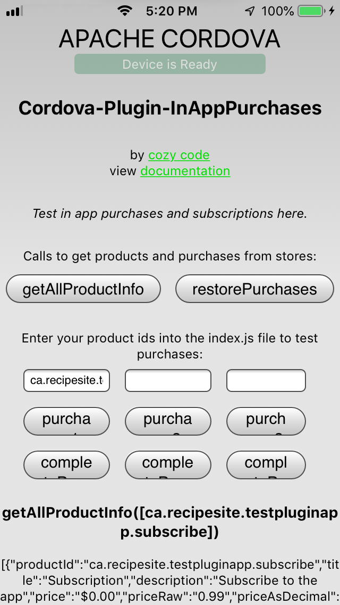

# Cordova-Plugin-InAppPurchases Testing App

This a test app to test in-app purchases and subscriptions with [**Cordova**](https://cordova.apache.org/) and [**cordova-plugin-inapppurchases**](https://github.com/cozycodegh/cordova-plugin-inapppurchases#Cordova-Plugin-InAppPurchases) by [cozycode.ca].

How to test in-app purchases with cordova:
1. Have your app idenifier string (eg. io.cordova.hellocordova) <br/>
    Log into the App Store Connect and Google Play to create your apps, make a "bundle identifier" (aka widget id, or app identifier)
2. Have create your product ids ready<br/>
    [See testing tips to create in-app products and subscriptions](https://github.com/cozycodegh/cordova-plugin-inapppurchases#testing-tips)
3. Create a cordova project to test in:
`cordova create new_test_dir app.bundle.identifier.to.test`
4. Add the in-app purchases plugin by `codecodegh`:
```
cd new_test_dir
cordova plugin add cordova-plugin-inapppurchases`
cd ..
```
4. Download this repository:
`git clone https://github.com/cozycodegh/cordova-plugin-inapppurchases_TESTAPP`
5. Move the files into the cordova project test directory:
`mv cordova-plugin-inapppurchases_TESTAPP/* new_test_dir/`
6. Edit the `www/js/index.js` file to include your product ids:
```
var product_id_1 = "ca.cozycode.non_consumable_product";
var product_id_2 = "";
var product_id_3 = "";
```
6.5. For Android, also create a `www/manifest.json` file with the `base64 billing key` in this test project:
    ```{ "play_store_key": "<Base64-encoded public key from the Google Play Store>" }```
7. Run the test app on different platforms:
```
cordova platform add ios
cordova run ios
cordova platform add android
cordova run --device android
```

#Test App Preview:
<p align="center">

</p>
<p align="center">


</p>


